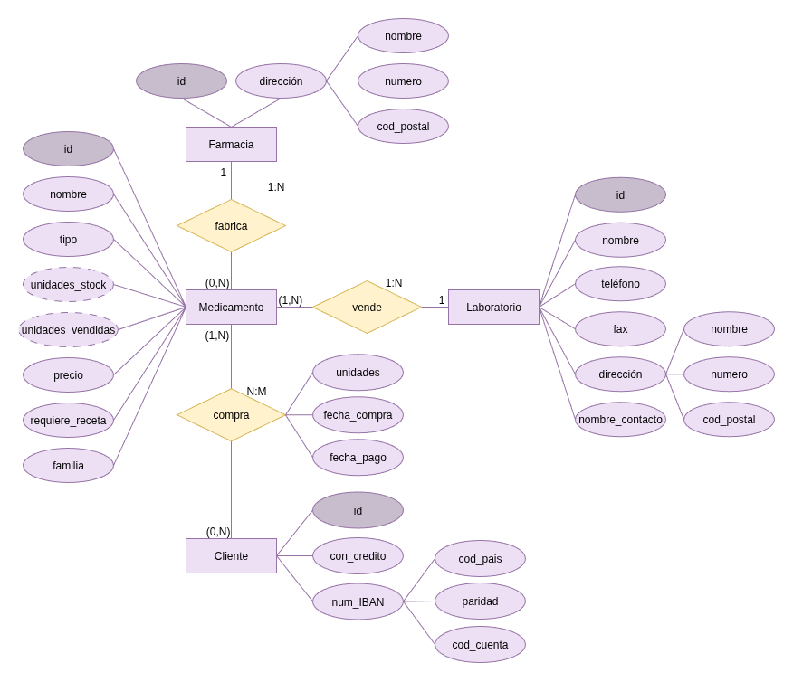
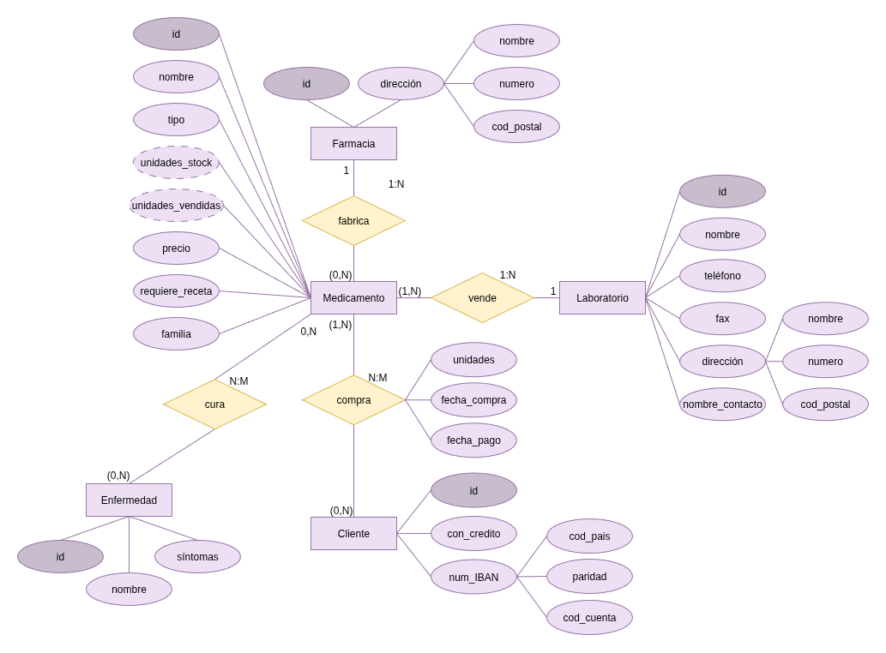

# Practica 2. Modelo Entidad/Relación. Farmacia.

## Objetivos

Los principales objetivos de esta práctica son los siguientes:
- Practicar la modelización conceptual mediante esquemas entidad/relación.

## Descripción del modelo

### Esquema

### Entidades

**Farmacia**:

| Atributo  | Dominio                       | Ejemplos   |
| --------- | ----------------------------- | ---------- |
| id        | Números enteros positivos  | 1, 2, 3, 4 |
| dirección | Atributo compuesto            |            |

**Medicamentos**:

| Atributo          | Dominio                             | Ejemplos                           |
| ----------------- | ----------------------------------- | ---------------------------------- |
| id                | Números enteros positivos           | 1, 2, 3, 4                         |
| nombre            | Cadena de caracteres                | "Ibuprofeno", "Paracetamol"        |
| tipo              | Cadena de caracteres                | "jarabe", "comprimido", "pomada"   |
| unidades_stock    | Números enteros positivos           | 37, 62, 144                        |
| unidades_vendidas | Números enteros positivos           | 122, 10, 500                       |
| precio            | Números con dos decimales positivos | 2.23, 20.95, 12.46                 |
| requiere_receta   | Booleano                            | true, false                        |
| familia           | Cadena de caracteres                | "antipiretico", "antiinflamatorio" |

**Laboratorios**:

| Atributo        | Dominio                                         | Ejemplos                 |
| --------------- | ----------------------------------------------- | ------------------------ |
| id              | Números enteros positivos                    | 1, 2, 3, 4               |
| nombre          | Cadena de caracteres                            | "Pfizer", "Bayern"       |
| teléfono        | Cadena de caracteres con 9 caracteres numéricos | "922200000", "928200000" |
| fax             | Cadena de caracteres con 9 caracteres numéricos | "922200001", "928200001" |
| dirección       | Atributo compuesto                              |                          |
| nombre_contacto | Cadena de caracteres                            | "Amelia", "Acaymo"       |

**Clientes**:

| Atributo    | Dominio                       | Ejemplos       |
| ----------- | ----------------------------- | -------------- |
| id          | Números enteros positivos  | 1, 2, 3, 4  |
| con_credito | Booleano                      | true, false    |
| num_cuenta  | Atributo compuesto            |                |

#### Atributos compuestos

**Dirección**:

| Atributo  | Dominio                                         | Ejemplos                     |
| --------- | ----------------------------------------------- | ---------------------------- |
| tipo      | Cadena de caracteres                            | "Calle", "Avenida", "Camino" |
| calle  | Cadena de caracteres                            | "Mendez Núñez", ""           |
| numero    | Números enteros positivos                    | 10, 12, 43                   |
| cod_post  | Cadena de caracteres con 5 caracteres numéricos | "38000", "28040"             |

**Cuenta**:

| Atributo   | Dominio                       | Ejemplos                  |
| ---------- | ----------------------------- | ------------------------- |
| cod_país   | Dos caracteres del alfabeto   | "ES", "IE"                |
| paridad    | Dos dígitos                   | 34, 97                    |
| cod_cuenta | 20 caracteres alfanuméricos   | "2077 0024 00 3102575766" |

### Relaciones

**Farmacia fabrica Medicamento**:

1:N
Un medicamento puede ser fabricado por 1 sola farmacia.
Una farmacia puede fabricar 0 o más medicamentos.

**Laboratorio vende Medicamento**:

1:N
Un medicamento es fabricado por 1 solo laboratorio.
Un laboratorio puede fabricar 1 o más medicamentos. (Si nos hubiera vendido 0 medicamentos, no lo tendríamos registrada)

**Cliente compra Medicamento**:

N:M
Un medicamento puede ser comprado por 0 o más clientes.
Un cliente puede comprar 1 o más medicamentos.

| Atributo     | Dominio                       | Ejemplos       |
| ------------ | ----------------------------- | -------------- |
| unidades     | Números enteros positivos  | 1, 2, 3, 4  |
| fecha_compra | Fecha                         | "2025-01-01"   |
| fecha_pago   | Fecha                         | "2025-01-01"   |

## Modificación

Añadir una entidad "enfermedad"

